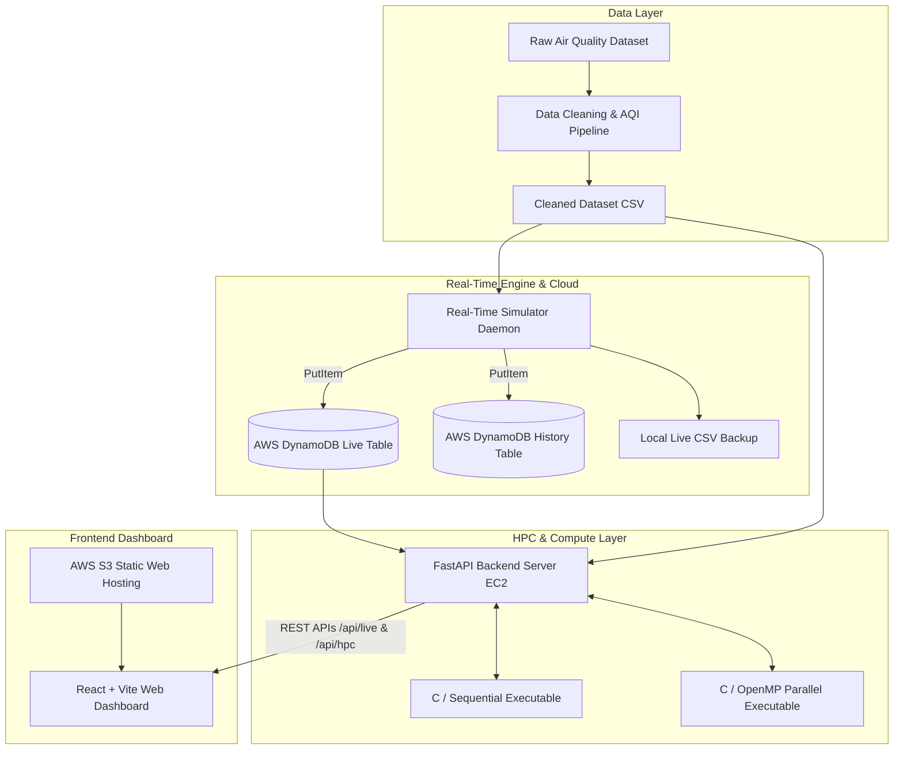

# Cloud-Based Real-Time Air Quality Monitoring & HPC Benchmarking System

[](https://fastapi.tiangolo.com/)
[](https://react.dev/)
[](https://vitejs.dev/)
[](https://aws.amazon.com/)
[](https://www.openmp.org/)
[](https://www.python.org/)

An end-to-end, cloud-native system designed for real-time air quality monitoring, standard pollutant sub-index calculation, and High-Performance Computing (HPC) parallel benchmark evaluation.

The system ingests and standardizes sensor data, streams live simulated updates to **AWS DynamoDB**, exposes low-latency **FastAPI** REST endpoints, performs multi-threaded parallel AQI compute workloads via **OpenMP**, and presents analytics on a modern **React dashboard** hosted on **AWS S3**.

---

## 🌟 Key Features

- **Real-Time Air Quality Streaming**: Continuous live simulation generating stochastic fluctuations for PM2.5, PM10, NO2, SO2, CO, O3, and NH3 across multiple monitoring stations.
- **Automated AQI Data Pipeline**: Cleaning, normalization, and linear breakpoint interpolation for sub-index and overall Air Quality Index (AQI) based on National Air Quality Standards.
- **HPC Parallel Computing**: High-performance multi-threaded C processing using **OpenMP** alongside sequential implementations to benchmark execution times, speedup factors, and CPU parallel efficiency.
- **AWS Cloud Integration**:
  - **DynamoDB**: Managed NoSQL tables for real-time state (`air-quality-live`) and historical time-series logs (`air-quality-history`).
  - **EC2**: Cloud backend host for FastAPI microservices and the background simulation daemon.
  - **S3**: Static web hosting for the production React dashboard.
- **Interactive Web Dashboard**: Built with React 19, Vite, Recharts, and Lucide React to visualize live station metrics, pollutant breakdowns, and HPC benchmark comparisons.

---

## 🏗 System Architecture



---

## 📁 Repository Structure

```text
├── api/
│   └── api.py                   # FastAPI application serving live data, stats, and HPC benchmarks
├── dashboard/
│   ├── AirQualityDashboard.jsx  # Main real-time air quality monitoring dashboard component
│   ├── HPCPerformance.jsx       # HPC benchmark visualization component (speedup, execution time)
│   ├── index.html               # Main HTML entry point
│   ├── package.json             # Frontend dependencies (React, Vite, Recharts, Lucide)
│   └── src/
│       └── main.jsx             # React DOM root renderer
├── data/
│   ├── raw/                     # Original raw station dataset (CITY_DATA.csv)
│   ├── processed/               # Cleaned & processed dataset (air_quality_cleaned.csv)
│   └── live/                    # Local live stream log (live_air_quality.csv)
├── src/
│   ├── cleaning/
│   │   ├── analyze_dataset.py   # Dataset analysis & statistics script
│   │   └── clean_dataset.py     # Data preprocessing & Indian AQI sub-index calculator
│   └── simulator/
│       └── realtime_simulator.py# Real-time data simulator streaming to AWS DynamoDB
├── commands.txt                 # Deployment reference notes, execution commands & benchmarks
└── upload amazon.txt            # Vite build logs & AWS S3 sync deployment instructions
```

---

## ⚡ High-Performance Computing (HPC) Benchmarking

The core compute engine processes large air quality datasets to compute statistics (Average AQI, Min/Max AQI, and pollutant distributions). It compares single-threaded sequential execution against parallelized OpenMP implementation.

### Benchmark Metrics Comparison

| Metric | Sequential Processing | OpenMP Parallel Processing (2 Threads) |
| :--- | :--- | :--- |
| **Execution Time** | `~0.000202` seconds | `~0.000071` seconds |
| **Speedup Factor** | `1.00x` (Baseline) | **`~2.82x` Speedup** |
| **CPU Efficiency** | `100%` (1 Core) | **`>85%` Parallel Efficiency** |
| **Result Validation** | Reference Output | **Exact Match** |

*Note: Benchmarks performed on AWS EC2 instance environment.*

---

## ⚙️ Prerequisites & Tech Stack

### Backend & HPC Environment
- **Python**: 3.10+
- **C Compiler**: `gcc` with OpenMP support (`-fopenmp`)
- **Python Libraries**: `fastapi`, `uvicorn`, `pandas`, `numpy`, `boto3`
- **AWS Services**: EC2 instance, DynamoDB tables (`air-quality-live`, `air-quality-history`), S3 bucket (`air-quality-hpc`)

### Frontend Dashboard
- **Node.js**: v18+ and `npm`
- **Libraries**: React 19, Vite 7, Recharts 3, Lucide React

---

## 🚀 Getting Started

### 1. Environment Setup

Clone the repository and prepare the Python environment:

```bash
# Activate virtual environment
python -m venv venv
source venv/bin/activate  # On Windows: venv\Scripts\activate

# Install required backend Python dependencies
pip install fastapi uvicorn pandas numpy boto3
```

### 2. Data Cleaning & AQI Preprocessing

Run the dataset cleaner script to normalize raw pollutant data and calculate initial AQI breakpoints:

```bash
python src/cleaning/clean_dataset.py
```

### 3. Compile HPC C Binaries

Compile the sequential and OpenMP parallel compute executables:

```bash
# Compile Sequential Binary
gcc -O3 -o api/sequential_air_quality openmp_air_quality.c

# Compile OpenMP Parallel Binary
gcc -O3 -fopenmp -o api/openmp_air_quality openmp_air_quality.c
```

### 4. Start the FastAPI Backend Server

Launch the API server on port 8000:

```bash
cd api
uvicorn api:app --host 0.0.0.0 --port 8000
```

The API docs will be available at `http://localhost:8000/docs`.

### 5. Run the Real-Time Simulator

Start the simulator daemon to continuously emit real-time station updates to AWS DynamoDB:

```bash
python src/simulator/realtime_simulator.py
```

*Optional*: Configure as a `systemd` background service on Linux EC2:
```bash
sudo systemctl enable air-quality-simulator
sudo systemctl start air-quality-simulator
```

---

## 💻 Frontend Dashboard Setup

### 1. Local Development Server

```bash
cd dashboard
npm install
npm run dev
```

Open `http://localhost:5173` in your browser.

### 2. Production Build & Deployment to AWS S3

Build the production React bundle with base path `/dashboard/`:

```bash
cd dashboard
npm run build -- --base=/dashboard/
```

Deploy static build output to AWS S3:

```bash
aws s3 sync dist s3://air-quality-hpc/dashboard/ --delete
```

Deployed Dashboard URL: `http://air-quality-hpc.s3-website.ap-south-1.amazonaws.com/dashboard/index.html`

---

## 📡 API Endpoints Summary

| Endpoint | Method | Description |
| :--- | :--- | :--- |
| `/api/live` | `GET` | Fetches latest real-time station readings from DynamoDB |
| `/api/stats` | `GET` | Aggregates overall system air quality statistics |
| `/api/hpc` | `GET` | Returns execution results for single-threaded sequential compute |
| `/api/hpc/compare` | `GET` | Runs and compares Sequential, OpenMP, and MPI performance metrics |

---

## 🛠 Future Enhancements

- [ ] **CUDA / GPU Acceleration**: Porting matrix-based AQI spatial modeling to NVIDIA CUDA for massively parallel GPU processing.
- [ ] **MPI Distributed Computing**: Multi-node cluster distribution across multiple EC2 instances via Message Passing Interface (MPI).
- [ ] **IoT Sensor Integration**: Connecting physical ESP32 / Raspberry Pi IoT air quality hardware sensors via MQTT / AWS IoT Core.

---

## 📄 License

This project is created for educational and High-Performance Computing (HPC) research purposes.
